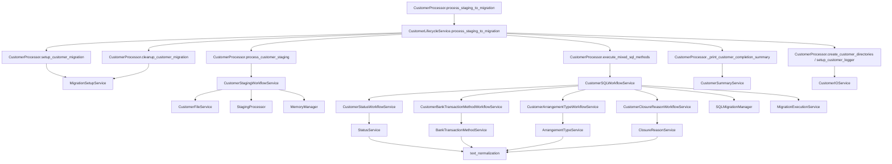

# Service Boundary Map

This document maps orchestration methods in CustomerProcessor to extracted services and shows the current execution flow.

## Primary Orchestrator

- CustomerProcessor remains the coordination facade for migration execution.
- Most operational concerns are delegated to focused services.

## Wrapper to Service Mapping

### Migration setup lifecycle

CustomerProcessor wrappers delegate to MigrationSetupService:

- load_entity_mapping -> load_entity_mapping
- create_migration_load_record -> create_migration_load_record
- rollback_load_record -> rollback_load_record
- create_migration_session -> create_migration_session
- close_migration_session -> close_migration_session
- setup_customer_migration -> setup_customer_migration
- cleanup_customer_migration -> cleanup_customer_migration

Files:
- customer_processor.py
- services/setup/migration_setup_service.py

### Customer filesystem and logging

CustomerProcessor wrappers delegate to CustomerIOService:

- create_customer_directories -> create_customer_directories
- setup_customer_logger -> setup_customer_logger
- cleanup_customer_logger -> cleanup_customer_logger

Files:
- customer_processor.py
- services/io/customer_io_service.py

### Customer file grouping and validation

CustomerProcessor wrappers delegate to CustomerFileService:

- extract_customer_code_from_filename -> extract_customer_code_from_filename
- group_files_by_customer -> group_files_by_customer
- validate_customers_against_entity_mapping -> validate_customers_against_entity_mapping
- validate_customer_files -> validate_customer_files
- move_files_to_customer_folder -> move_files_to_customer_folder
- queue_files_for_move -> queue_files_for_move
- flush_pending_file_moves -> flush_pending_file_moves
- reset_pending_file_moves -> reset_pending_file_moves

File moves are deferred, not immediate. The staging workflow queues each group onto
processor.pending_file_moves as its table is inserted; the queue is only flushed by
CustomerSQLWorkflowService once the status, bank transaction method and arrangement
type checks have all been confirmed at the GATE_SQL prompt. Any earlier return —
a failed transform, a declined gate, an exception — leaves the source folder untouched
so the customer can be re-run. process_customer_staging resets the queue per customer.

Files:
- customer_processor.py
- services/io/customer_file_service.py

### Staging workflow

CustomerProcessor wrappers delegate to CustomerStagingWorkflowService:

- process_customer_staging -> process_customer_staging
- _validate_customer_files_step -> validate_customer_files_step
- _truncate_staging_tables_step -> truncate_staging_tables_step
- _process_customer_tables_step -> process_customer_tables_step
- _create_staging_failure_result -> create_staging_failure_result

Files:
- customer_processor.py
- services/workflows/customer_staging_workflow_service.py

### Status normalization and validation workflow

CustomerProcessor wrappers delegate to CustomerStatusWorkflowService:

- update_rc_account_extract_ma_status -> update_rc_account_extract_ma_status
- _check_status_codes_step -> check_status_codes_step
- _load_account_status_mapping_frame -> load_account_status_mapping_frame
- _build_ma_status_resolution_frame -> build_ma_status_resolution_frame
- _bulk_update_rc_account_extract_ma_status -> bulk_update_rc_account_extract_ma_status
- _get_invalid_ma_statuses_from_db -> get_invalid_ma_statuses_from_db
- _status_match_key -> status_match_key
- _status_match_key_series -> status_match_key_series
- _normalize_status_lookup_key -> normalize_status_lookup_key
- _normalize_status_lookup_series -> normalize_status_lookup_series

Files:
- customer_processor.py
- services/workflows/customer_status_workflow_service.py

### Bank transaction method normalization and validation workflow

Runs immediately after the status workflow, applying the same pattern to the staging
Payment_Method columns of RC_PAYMENTS, RC_DEAL and RC_ARRANGEMENT: rewrite in place to
the canonical tblBankTransactionMethod label, then report anything still unmapped.
Its results are surfaced through the same GATE_SQL approval prompt.

CustomerProcessor wrappers delegate to CustomerBankTransactionMethodWorkflowService:

- update_payment_methods -> update_payment_methods
- _check_bank_transaction_methods_step -> check_bank_transaction_methods_step
- _load_bank_transaction_method_mapping_frame -> load_bank_transaction_method_mapping_frame
- _build_payment_method_resolution_frame -> build_payment_method_resolution_frame
- _bulk_update_payment_methods -> bulk_update_payment_methods
- _get_invalid_payment_methods_from_db -> get_invalid_payment_methods_from_db

Files:
- customer_processor.py
- services/workflows/customer_bank_transaction_method_workflow_service.py

### Arrangement type normalization and validation workflow

Runs after the bank transaction method workflow, applying the same pattern to
RC_ARRANGEMENT.Arrangement_Type against tblArrangementType. It differs from the other
two in one respect: NULL/blank values are filled with the default label configured in
variables/arrangement_type_codes.json ('Payment Plan' as shipped), so the default is
data rather than a constant in code. Its results are surfaced through the same GATE_SQL
approval prompt.

CustomerProcessor wrappers delegate to CustomerArrangementTypeWorkflowService:

- update_arrangement_types -> update_arrangement_types
- _check_arrangement_types_step -> check_arrangement_types_step
- _load_arrangement_type_mapping_frame -> load_arrangement_type_mapping_frame
- _resolve_arrangement_type_default_label -> resolve_default_label
- _build_arrangement_type_resolution_frame -> build_arrangement_type_resolution_frame
- _bulk_update_arrangement_types -> bulk_update_arrangement_types
- _get_invalid_arrangement_types_from_db -> get_invalid_arrangement_types_from_db

Files:
- customer_processor.py
- services/workflows/customer_arrangement_type_workflow_service.py

### Closure reason normalization and validation workflow

Runs last of the four mapping workflows, over RC_ACCOUNT_EXTRACT.Reason_Closed against
tblClosureReason. Its defaulting rule is the inverse of the arrangement type workflow:
NULL and blank are left untouched, because absence of a closure reason is meaningful,
while a value that fails to map is swept to the label configured as
`default_for_unmapped` in variables/closure_reason_codes.json ('Other Reason - Please
see notes' as shipped). The key is deliberately named differently from the arrangement
type file's `default` so the two triggers cannot be confused.

Because the sweep catches everything, the check reports which raw values were defaulted
rather than which are invalid; invalid values only appear when the fallback is switched
off with a blank `default_for_unmapped`.

CustomerProcessor wrappers delegate to CustomerClosureReasonWorkflowService:

- update_closure_reasons -> update_closure_reasons
- _check_closure_reasons_step -> check_closure_reasons_step
- _load_closure_reason_mapping_frame -> load_closure_reason_mapping_frame
- _resolve_closure_reason_fallback_label -> resolve_fallback_label
- _build_closure_reason_resolution_frame -> build_closure_reason_resolution_frame
- _bulk_update_closure_reasons -> bulk_update_closure_reasons
- _get_invalid_closure_reasons_from_db -> get_invalid_closure_reasons_from_db

Files:
- customer_processor.py
- services/workflows/customer_closure_reason_workflow_service.py

### SQL migration workflow

CustomerProcessor wrappers delegate to CustomerSQLWorkflowService:

- execute_mixed_sql_methods -> execute_mixed_sql_methods
- _initialize_sql_manager_step -> initialize_sql_manager_step
- _prepare_sql_files_step -> prepare_sql_files_step
- _export_sql_files_step -> export_sql_files_step
- _execute_sql_files_step -> execute_sql_files_step
- _collect_migration_metrics_step -> collect_migration_metrics_step
- _process_sql_execution_results_step -> process_sql_execution_results_step
- _create_sql_failure_result -> create_sql_failure_result
- _get_financial_tables_from_metrics -> get_financial_tables_from_metrics

Files:
- customer_processor.py
- services/workflows/customer_sql_workflow_service.py

## Existing Specialized Services

CustomerProcessor also delegates to these existing services:

- MigrationExecutionService for mixed SQL execution internals.
- CustomerLifecycleService for customer-by-customer orchestration.
- CustomerSummaryService for completion summary rendering.
- StatusService for low-level status normalization and DB update primitives.
- BankTransactionMethodService for low-level Payment_Method normalization and DB update primitives.
- ArrangementTypeService for low-level Arrangement_Type normalization and DB update primitives.
- ClosureReasonService for low-level Reason_Closed normalization and DB update primitives.
- text_normalization for the lookup-key rules shared by all four mapping services.

## High-Level Call Graph

## Notes

- Wrapper methods were intentionally kept in CustomerProcessor to preserve call sites and behavior.
- Service methods accept processor as a context object to minimize migration risk.
- The SQL workflow service includes a defensive fix for num_migration_tables initialization to avoid runtime NameError.
- Root-level service module filenames are backward-compatible import shims for legacy imports.
- services/* module names are also compatibility shims that point to canonical implementations in services/io, services/workflows, services/setup, services/execution, and services/orchestration.
