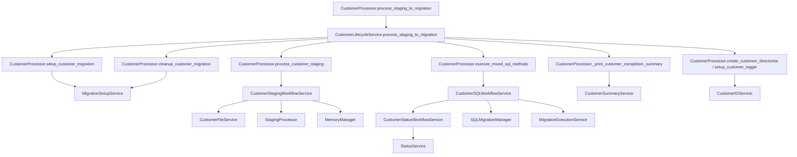

# Service Boundary Map

This document maps orchestration methods in CustomerProcessor to extracted services and shows the current execution flow.

## Primary Orchestrator

- CustomerProcessor remains the coordination facade for migration execution.
- Most operational concerns are delegated to focused services.

## Wrapper to Service Mapping

### Migration setup lifecycle

CustomerProcessor wrappers delegate to MigrationSetupService:

- load_entity_mapping -> load_entity_mapping
- create_migration_load_record -> create_migration_load_record
- rollback_load_record -> rollback_load_record
- create_migration_session -> create_migration_session
- close_migration_session -> close_migration_session
- setup_customer_migration -> setup_customer_migration
- cleanup_customer_migration -> cleanup_customer_migration

Files:
- customer_processor.py
- services/setup/migration_setup_service.py

### Customer filesystem and logging

CustomerProcessor wrappers delegate to CustomerIOService:

- create_customer_directories -> create_customer_directories
- setup_customer_logger -> setup_customer_logger
- cleanup_customer_logger -> cleanup_customer_logger

Files:
- customer_processor.py
- services/io/customer_io_service.py

### Customer file grouping and validation

CustomerProcessor wrappers delegate to CustomerFileService:

- extract_customer_code_from_filename -> extract_customer_code_from_filename
- group_files_by_customer -> group_files_by_customer
- validate_customers_against_entity_mapping -> validate_customers_against_entity_mapping
- validate_customer_files -> validate_customer_files
- move_files_to_customer_folder -> move_files_to_customer_folder

Files:
- customer_processor.py
- services/io/customer_file_service.py

### Staging workflow

CustomerProcessor wrappers delegate to CustomerStagingWorkflowService:

- process_customer_staging -> process_customer_staging
- _validate_customer_files_step -> validate_customer_files_step
- _truncate_staging_tables_step -> truncate_staging_tables_step
- _process_customer_tables_step -> process_customer_tables_step
- _create_staging_failure_result -> create_staging_failure_result

Files:
- customer_processor.py
- services/workflows/customer_staging_workflow_service.py

### Status normalization and validation workflow

CustomerProcessor wrappers delegate to CustomerStatusWorkflowService:

- update_rc_account_extract_ma_status -> update_rc_account_extract_ma_status
- _check_status_codes_step -> check_status_codes_step
- _load_account_status_mapping_frame -> load_account_status_mapping_frame
- _build_ma_status_resolution_frame -> build_ma_status_resolution_frame
- _bulk_update_rc_account_extract_ma_status -> bulk_update_rc_account_extract_ma_status
- _get_invalid_ma_statuses_from_db -> get_invalid_ma_statuses_from_db
- _status_match_key -> status_match_key
- _status_match_key_series -> status_match_key_series
- _normalize_status_lookup_key -> normalize_status_lookup_key
- _normalize_status_lookup_series -> normalize_status_lookup_series

Files:
- customer_processor.py
- services/workflows/customer_status_workflow_service.py

### SQL migration workflow

CustomerProcessor wrappers delegate to CustomerSQLWorkflowService:

- execute_mixed_sql_methods -> execute_mixed_sql_methods
- _initialize_sql_manager_step -> initialize_sql_manager_step
- _prepare_sql_files_step -> prepare_sql_files_step
- _export_sql_files_step -> export_sql_files_step
- _execute_sql_files_step -> execute_sql_files_step
- _collect_migration_metrics_step -> collect_migration_metrics_step
- _process_sql_execution_results_step -> process_sql_execution_results_step
- _create_sql_failure_result -> create_sql_failure_result
- _get_financial_tables_from_metrics -> get_financial_tables_from_metrics

Files:
- customer_processor.py
- services/workflows/customer_sql_workflow_service.py

## Existing Specialized Services

CustomerProcessor also delegates to these existing services:

- MigrationExecutionService for mixed SQL execution internals.
- CustomerLifecycleService for customer-by-customer orchestration.
- CustomerSummaryService for completion summary rendering.
- StatusService for low-level status normalization and DB update primitives.

## High-Level Call Graph

## Notes

- Wrapper methods were intentionally kept in CustomerProcessor to preserve call sites and behavior.
- Service methods accept processor as a context object to minimize migration risk.
- The SQL workflow service includes a defensive fix for num_migration_tables initialization to avoid runtime NameError.
- Root-level service module filenames are backward-compatible import shims for legacy imports.
- services/* module names are also compatibility shims that point to canonical implementations in services/io, services/workflows, services/setup, services/execution, and services/orchestration.
